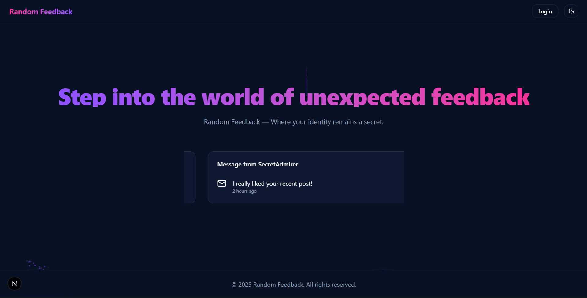
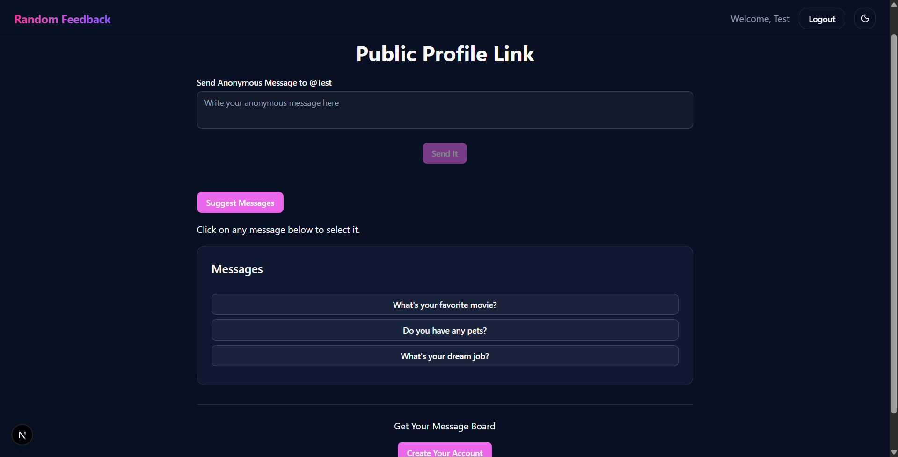
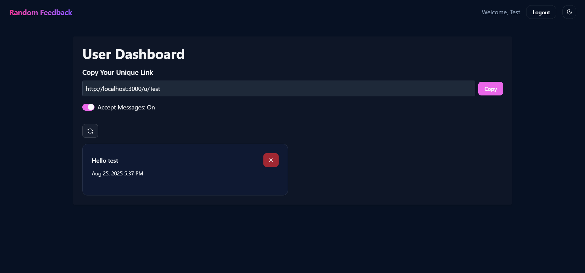

# 🎯 Random Feedback

A **Next.js 15** web application that allows registered users to receive **anonymous/random feedback** via a unique URL.  
Built with **MongoDB, NextAuth, Resend (email verification), and OpenAI API** for suggested feedback messages.  

---

## 🚀 Features

- 🔑 **Authentication** with [NextAuth](https://next-auth.js.org/)  
- 📧 **Email Verification** using [Resend](https://resend.com/)  
- 🗄️ **Database** powered by [MongoDB + Mongoose](https://mongoosejs.com/)  
- 📝 **Anonymous Feedback** – anyone with your unique link can send feedback **without logging in**  
- 🎛️ **Control Feedback** – registered users can enable/disable receiving random feedback  
- 🤖 **AI Suggestions** – integrated with OpenAI API to generate suggested feedback messages  
- 🎨 **Modern UI** – built with Tailwind CSS v4, Radix UI, and animations  

---

## 🛠️ Tech Stack

- **Frontend & Backend**: [Next.js 15](https://nextjs.org/) (App Router)  
- **Database**: [MongoDB](https://www.mongodb.com/) + [Mongoose](https://mongoosejs.com/)  
- **Authentication**: [NextAuth.js](https://next-auth.js.org/)  
- **Email Service**: [Resend](https://resend.com/)  
- **AI Suggestions**: [OpenAI API](https://platform.openai.com/)  
- **UI Components**: Tailwind CSS v4, Radix UI, Sonner  

---

## 📂 Project Setup

Clone the repository:

```bash
git clone https://github.com/bhuvan649/RandomFeedback.git
cd RandomFeedback
```
### Install dependencies:
```bash
npm install
```

### Run the development server:
```bash
npm run dev
```

### ⚙️ Environment Variables
Rename .env.sample to .env and add your api keys:

NEXTAUTH_SECRET="your-secret-key"
MONGODB_URI="your-mongodb-uri"
RESEND_API_KEY="your-resend-api-key"
OPENAI_API_KEY="your-openai-api-key"

For reference, check the provided .env.sample.

### 🔑 Usage Flow

1. Register with email → verification link is sent via Resend.
2. After verification, you receive a unique URL.
3. Share this link → others can send you random feedback (no login required).
4. You can enable/disable feedback collection from your dashboard.
5. Use AI-suggested messages (powered by OpenAI) to get better feedback responses.

### 📸 Screenshots




### 📬 Feedback & Contribution
Contributions are welcome!
If you’d like to add features or fix issues:
```bash
# create a new branch
git checkout -b feature/your-feature-name

# commit changes
git commit -m "Added new feature"

# push branch
git push origin feature/your-feature-name
```
Then open a Pull Request 🚀

### 📄 License
This project is licensed under the MIT License – feel free to use and modify for your own projects.

### ⭐ Support

If you find this project helpful, don’t forget to star the repo on GitHub 🌟

